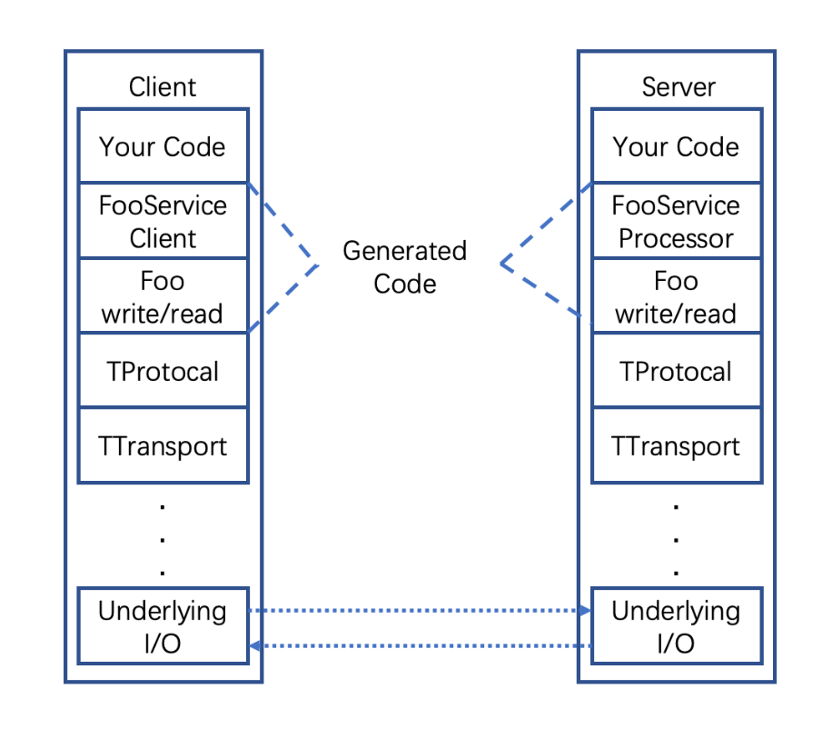

# netty_lecture
netty test
#### Apache Thrift
> Thrift是一个典型的C/S结构，客户端和服务器端可以使用不同的语言开发。
>客户端和服务端的关联语言就是IDL(Interface Description Language)

Thrift数据类型
* byte 有符号字节
* i16 16位有符号整数
* i32 32位有符号整数
* i64 64位有符号整数
* double 64位浮点数
* string 字符串

**Thrift工作原理：**
>实现多语言通信

* 数据传输使用socket(多语言均支持)，数据在以特定的格式发送（如String）,接收放接收后在进行解析。
* 定义thrift文件，由thrift文件（IDL）生成双方语言的接口、model,在生成的model以及的接口中会有解码编码的代码

Thrift的 IDL文件
* struct:目的就是将一些数据聚合在一起，方便传输管理（理解为类）
* enum:枚举的定义和java类似
* exception:thrift支持自定义异常，规则与struct类似
* service:服务相当于java代码中的interface,创建的service在经过代码生成后，就会生成客户端和服务器端的框架代码。
* typedef:类型定义，比如typedef i32 int; 将i32的数据类型定义为int
* const:使用const关键字作常量定义
* namespace:命名空间相当于java中的package,格式namespace 语言 路径，比如 namespace java com.cherry.test
* include:文件包含，相当于java的import
* required,optional：必须和可选字段
如何注释：# //开头，/**/包含的也是注释
执行命令：thrift --gen java src/main/thrift/data.thrift 生成对应java语言的文件

**Thrift架构：**

**Thrift传输协议：**
* TBinaryProtocol -- 二进制格式
* TCompactProtocol -- 压缩格式
* TJSONProtocol -- JSON格式
* TSimpleJSONProtocol -- 提供JSON只写协议，生成的文件很容易通过脚本语言解析
* TDebugProtocol -- 使用易懂的可读的文本格式，以便debug
**Thrift数据传输方式：**
* TSocket --阻塞式Socket
* TFramedTransport -- 以frame为单位进行传输，非阻塞式服务中使用。
* TFileTransport -- 以文件形式进行传输。
* TMemoryTransport -- 将内存用于I/O. java实现时内部使用了ByteArrayOutputStream
* TZlibTransport -- 使用zlib压缩，与其他传输方式联合使用。当前无java实现
**Thrift支持的服务模型：**
* TSimpleServer --简单的单线程服务模型，常用于测试
* TThreadPoolServer -- 多线程服务模型，使用标准的阻塞式IO
* TNonblockingServer -- 多线程服务模型，使用非阻塞式IO(需要使用TFramedTransport数据传输方式)
* THsHaServer -- THsHa引入线程池去处理，其模型把读写任务放到线程池去处理；Half-sync/Half-async的处理模式，Half-async是在处理IO事件上（accept/read/write io）,Half-sync用于handler对rpc的同步调用

